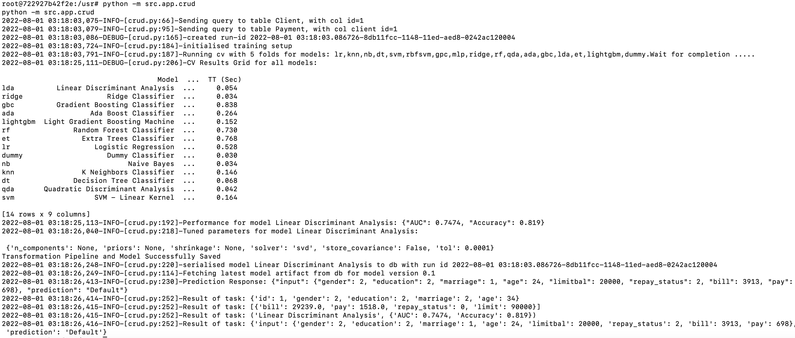

# Examples of deploying and hosting a Machine Learning Model with FastAPI

This repository contains code for asynchronous example api using the [Fast Api framework](https://fastapi.tiangolo.com/), 
[Uvicorn server](https://www.uvicorn.org/), [SQlAlchemy](https://www.sqlalchemy.org/), Postgres Database for crud operations in db tables.
It also uses the [PyCaret library](https://pycaret.org/) to train machine learning models and generated predictions for data 
received from requests to API.

## Creating dev environment

We have defined the services that make up your app in `docker-compose.yml` so they can be run together in an 
isolated environment. We have defined four services:

  * **dev**: The dev service uses an image that’s built from the Dockerfile in the src directory. It copies the applciation code into container and 
    installs the dependencies from requirements file. We will use this mainly for development purposes - ie testing the scripts and 
    populating the db with data etc
  * **web**: The web service deploys the app. Since we want to start the server when the container is run, 
    we specify the command for the uvicorn server program to run the Fast API application in the CMD option.
    We have mapped the host port to the exposed port, 80 on the container. The container is listening on the default port 80.
  * **db**: This db service uses a public Postgres image, pulled from the Docker Hub registry. We have also configured default
    env vars to create a postgres server and db instance with the username and password. We have mapped the ports 5432:5432, to be able to 
    connect to postgres in the container with any tool from a host machine (e.g. pg admin).
  * **redis**: The redis service uses a public Redis image pulled from the Docker Hub registry.

From the project directory, run the following command to build the images for all the services listed in compose.yaml. 

```
$ docker compose build
```

Since our application code in dev container interacts with the db, we require the postgres container 
to be built and run before the dev image can be built. We have defined these services in the `depends on` property.
for the 'dev' service in docker-compose.yaml. The build command above should automatically start the 
`db` and `redis` services in the background.


We can now start the dev service container by running the command `docker compose run dev`
If the command ran successfully,  we should be inside the container shell as we specified bash command as entrypoint
in dockerfile. We can then check the code is correctly copied over during the build phase and that we
have the correct version of python etc


To run the webapp service, we can run `docker compose run webapp`. We could also start all containers at the same 
time using `docker compose up`. To run containers silently in the background use `docer compose up -d` 


For the containers running the web and dev services, we have also configured the volume property in `docker-compose.yml`,
so the application code is mounted into the container using a volume. This allows us to make changes to the code from 
outside the container (e.g. via Pycharm on host machine) and see the changes instantly updated in the container, 
without having to rebuild the image.

### Terminating active processes

Sometimes we may get an error in running the servers on container if the port it is required to run on is currently in use.
We will need to the run the following commands to list the active processes (PID) for the given port and then pass the PID to the `kill`
command

```
$ sudo lsof -i tcp:<port>
$ sudo kill -9 <PID>
```
if you have installed PostgreSQL from the EnterpriseDB and running the server on
local machine, then the above commands will fail to disable postgres process, as it will spawn new processes again 
and again with a different PID. This is because of a `plist` configuration file in the LaunchDaemons folder, which schedules 
postgresql server to be always on when the computer is on. Hence we need to remove this `plist` file using the 
command below (note the path to this file may vary depending on the postgresql version installed)

```
sudo launchctl unload /Library/LaunchDaemons/com.edb.launchd.postgresql-13.plist  
rm -rf /Library/LaunchDaemons/com.edb.launchd.postgresql-13.plist
```

## Update Tables in DB

First we need to udpate the client and payments table in the postgres database. we will be using data packaged in
the pycaret library, which is based on a dataset from UCI called Default of Credit Card Clients Dataset 
(https://archive.ics.uci.edu/ml/datasets/default+of+credit+card+clients).

This dataset contains information on default payments, demographic factors, credit data, payment history, and billing statements of credit card clients in Taiwan from April 2005 to September 2005. There are 24,000 samples and 25 features. Short descriptions of each column are as follows:

* **ID**: ID of each client
* **LIMIT_BAL**: Amount of given credit in NT dollars (includes individual and family/supplementary credit)
* **SEX**: Gender (1=male, 2=female)
* **EDUCATION*: (1=graduate school, 2=university, 3=high school, 4=others, 5=unknown, 6=unknown)
* **MARRIAGE**: Marital status (1=married, 2=single, 3=others)
* **AGE**: Age in years
* **PAY_0 to PAY_6**: Repayment status by n months ago (PAY_0 = last month ... PAY_6 = 6 months ago) (Labels: -1=pay duly, 1=payment delay for one month, 2=payment delay for two months, ... 8=payment delay for eight months, 9=payment delay for nine months and above)
* **BILL_AMT1 to BILL_AMT6**: Amount of bill statement by n months ago ( BILL_AMT1 = last_month .. BILL_AMT6 = 6 months ago)
* **PAY_AMT1 to PAY_AMT6**: Amount of payment by n months ago ( BILL_AMT1 = last_month .. BILL_AMT6 = 6 months ago)
* **default**: Default payment (1=yes, 0=no) Target Column

In the dev container, run the following commands:

```
root@722927b42f2e:/usr# python -m src.load_data_into_tables
```

You should see output like below. This will connect to the db in the postgres server running in the db container 
and create the postgres tables using the SQLAlchemy ORM classes in `models.py` mapped to those tables.


## Run all methods asynchronously

The `src/app/crud.py` module defines all the functions which will be called by the path operation 
functions defined in the `main.py` module. We have declared our path operation functions with `async def` in 
`main.py` which will allow us to await coroutines inside these functions. To take advantage of this option that
FastAPI provides for asynchronosity, most of the functions we created in `src/app/crud.py` will be native coroutines
which will either use `await` and/or `return` in the code block. To call a coroutine function, you must await it to get 
its results.A key feature of coroutines is that they can be chained together. As a coroutine object is awaitable,
so another coroutine can await it. This allows one to break programs into smaller, manageable, 
recyclable coroutines [8]

The `async def main()` coroutine creates concurrent tasks for running db queries, ml model training and prediction 
functions which are used in the FastAPI resources we will create later.  This will run the coroutines in event loops [3]. If a coroutine awaits on a Future, the Task suspends the execution of the coroutine and waits for the 
completion of the Future. When the Future is done, the execution of the wrapped coroutine resumes [3]. This also
awaits coroutine `schedule_coroutine_tasks` which returns the results of the tasks as they are completed.
We can log the result of each task which should be in the same order of task completion.

**Note**: Some of these tasks maybe more CPU bound than I/O bound, like the ML training workflow.
This may not benefit so much from concurrent execution and maybe more beneficial to use parallelism and 
multiprocessing.

We can run the module using the command below. We need to `cd` one dir up so crud.py can find the `src` 
package when referencing imports.

```
root@7c18292737ab:/usr# python -m app.crud
```

We can see the logs in the screenshot below. The logs towards the end correspond to the results of the 
completed tasks. The logs are returned from the tasks in order of completion. As we expect, the db query tasks
complete faster than the model training and prediction workflows.




## Interactive API documentation

The `main.py` module defines the path operation functions and decorators and the app object which is an instance of the class FastAPI. 
This will be the main point of interaction to create your API. This app object is the same one referred to 
in the command to run the live server with uvicorn in the Dockerfile `CMD`.
The great part of FastAPI is that it takes care of API documentation out-of-the-box. 
To view the API documentation we can go [http://127.0.0.1:8000/docs](http://127.0.0.1:8000/docs) 
as we have added port forwarding to forward traffic from port 8000 to port 80 where server is listening on.The automatic documentation uses SwaggerUI.
See below:


We will discuss the various API created in the sections below:

### Root path operation

If the dev environment section was configured properly, we should have a running container serving a redis db.

A request sent to the root path ('/') will be cached as a 'hit' in the redis db and a response sent back to
the user showing the number of times the pages has been visited. If further requests are sent, this number will
increment and we should see that in the response.

The screenshot below shows the response after two requests were sent to the root path.


### DB Queries

We have created three routes for handling specific db queries from clients and payments tables.

The `@app.get("/query/clients/{id}")` route expects an integer as a path parameter [4] for the id value. 
We will then take that parameter and query the clients table to return client id having the id value passed. 
When testing, make sure you are using ids that exist in your database.


The `@app.get("/query/clients/age/")` path operation expects query string parameters (key-value pairs). Since
the function parameters are not part of the path parameters, they are automatically interpreted as "query" 
parameters by Fast API [5].This will query the clients table and filter using the query parameter values , and then
compute the average age for the filtered list of clients.
We have declared all query parameters as optional, by setting their default to None. So we could specify either all 
or none of the attributes to filter the table by. If none are specified, then the average age is returned for all
the clients in the table.


### Start Training Workflow

The `@app.get("/train/data/")` path operation does not expect any parameters. A request will return 
a response containing all the training data used for training the model

The `@app.get("/train/model/")` path operation expects query string parameters `folds` and `version`, which 
correspond to the number of cv folds and model version we want to tag the trained model serialised in the db.
These are optional parameters and have default values defined (which should be visible in the API docs).
The execution should return the best model and associated score after training all the available models
in the PyCaret library.


### Realtime Prediction

We are now ready to invoke API and fetch predictions for unseen data we send to API, as a request body.
We have created a route `@app.post("/predict/realtime/", status_code=200)` with post method as we will be sending 
data, when invoking the API. To declare a request body, we add the parameter to the path operation function  (the same way path and query parameters are declared).
We then need to create a Pydantic Data Model for request body attributes and expected types. The data models are declared as 
class and inherit from BaseModel in Pydantic library. We can declare the type of the request body parameter declared earler,
as the Pydantic model created. With the type declaration, FastAPI will be able to read the body of the request as JSON, 
convert the corresponding types as defined in the pydantic model and validate the data.
If the data is invalid, it will return a nice and clear error, indicating exactly where and what was the incorrect data.
Finally, if validation check has passed, the received data will be available as pydantic model object. However, we
will need this as a dictionary before passing in as a parameter to our methods in backend, so we will convert the model
using `model.dict`  [7] 

Navigate to the corresponding resource section in the API docs. 


For cases, where  body, path and query parameters are passed in as function parameters, FastAPI is able to 
recognise each of them and take data from the correct place. As described in [6], it uses this strategy: 

* If the parameter is also declared in the path, it will be used as a path parameter.
* If the parameter is of a singular type (like int, float, str, bool, etc) it will be interpreted as a query parameter.
* If the parameter is declared to be of the type of a Pydantic model, it will be interpreted as a request body.

### Clean up

To teardown all the containers, run the following command 

```
docker compose down
```


To delete all the images, we can either delete them individually using the image id which can be 
retrieved from the `docker images` command and passing it to the command below

```
docker image rm <IMAGE-ID> -f    
```

or deleting multiple images at once which share a common name pattern

```
docker rmi $(docker images | grep 'fastapi') 
```

## References


* 1 Pycaret Documentation https://pycaret.gitbook.io/docs/ 
* 2 Async with Fast API https://fastapi.tiangolo.com/async/
* 3 Coroutines and Tasks https://docs.python.org/3/library/asyncio-task.html
* 4 Path Parameters https://fastapi.tiangolo.com/tutorial/path-params/
* 5 Query Parameters https://fastapi.tiangolo.com/tutorial/query-params/
* 6 Request Body with Pydantic Model https://fastapi.tiangolo.com/tutorial/body/
* 7 https://pydantic-docs.helpmanual.io/usage/exporting_models/
* 8 Good Resource on Async IO https://realpython.com/async-io-python/
